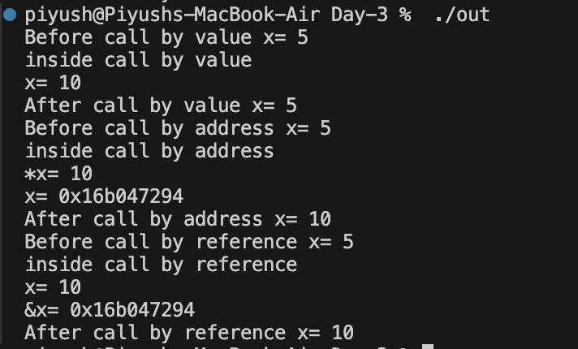

### 08-08-2024 
# DAY-3 

## Q1 . Wap to implement call by value call by adress and call by refernce . (as a hint in this experimnet write a oberevation about how a value moving from function call to function defination and return back to the function call , the number of variable used in each type of function call and also calculate the space reaquired )

### implementation 

```
#include <iostream>
using namespace std;
class TestDifferentCallTypes {
public:
    void callByValue(int x) {
        x = 10;
        cout << "inside call by value" << endl;
        cout << "x= " << x << endl;
    }
    void callByAddress(int *x) {
        *x = 10;
        cout << "inside call by address" << endl;
        cout << "*x= " << *x << endl;
        cout << "x= " << x << endl;
    }
    void callByReference(int &x) {
        x = 10;
        cout << "inside call by reference" << endl;
        cout << "x= " << x << endl;
        cout << "&x= " << &x << endl;
    }
};

int main() {
    TestDifferentCallTypes obj;
    int x = 5;
    cout << "Before call by value x= " << x << endl;
    obj.callByValue(x);
    cout << "After call by value x= " << x << endl;
    x = 5;
    cout << "Before call by address x= " << x << endl;
    obj.callByAddress(&x);
    cout << "After call by address x= " << x << endl;
    x = 5;
    cout << "Before call by reference x= " << x << endl;
    obj.callByReference(x);
    cout << "After call by reference x= " << x << endl;
    return 0;
}

```
### Output


